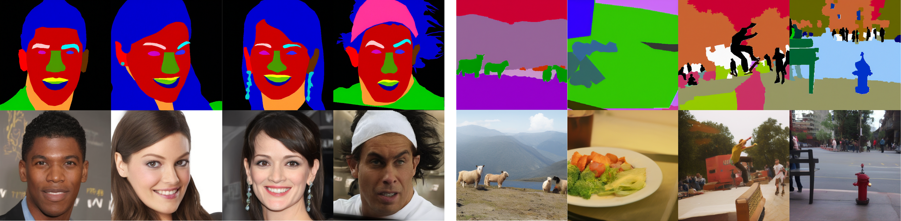

[](https://www.python.org/downloads/release/python-3918/)
[](https://mkdocstrings.github.io)
[](https://wandb.ai/site)

# Symmetrical Flow Matching

<p align="center">
  
</p>

The official implementation of [**Symmetrical Flow Matching: Unified Image Generation, Segmentation, and Classification with Score-Based Generative Models**](https://arxiv.org/abs/2506.10634).

**[Francisco Caetano](https://caetas.github.io)<sup>1</sup>, [Christiaan Viviers](https://scholar.google.com/citations?hl=en&user=wE8xva4AAAAJ)<sup>1</sup>, [Peter H.N. de With](https://www.tue.nl/en/research/researchers/peter-de-with)<sup>1</sup>, [Fons van der Sommen](https://scholar.google.com/citations?user=qFiLkCAAAAAJ&hl=en&oi=ao)<sup>1</sup>**

¹ Eindhoven University of Technology  

## Prerequisites

You will need:

- `python` (see `pyproject.toml` for full version)
- `Git`
- `uv`
- a `.secrets` file with the required secrets and credentials
- load environment variables from `.env`
- `NVIDIA Drivers`(mandatory) and `CUDA >= 12.8` (mandatory if Docker/Apptainer is not used)
- `Weights & Biases` account

## Installation

Clone this repository (requires git ssh keys)

    git clone --recursive git@github.com:caetas/SymmetricFlow.git
    cd SymmetricFlow

### Using uv

Create the environment and install the dependencies:

    uv sync --python3.12

#### Activate the environment on Linux

You can activate the environment with:

    source .venv/bin/activate

You might be required to run the following command once to setup the automatic activation of the conda environment and the virtualenv:

    direnv allow

Feel free to edit the [`.envrc`](.envrc) file if you prefer to activate the environments manually.

### Using Docker or Apptainer

Create a `.secrets` file and add your Weights & Biases API Key:

    WANDB_API_KEY = <your-wandb-api-key>

#### Docker

Create the image using the provided [`Dockerfile`](Dockerfile)

    docker build --tag symmflow .

Or download it from the Hub:

    docker pull docker://ocaetas/symmflow

Then run the script [`job_docker.sh`](scripts/job_docker.sh) that will execute [`main.sh`](scripts/main.sh):

    cd scripts
    bash job_docker.sh

To access the shell, please run:

    docker run --rm -it --gpus all --ipc=host --env-file .env -v $(pwd)/:/app/ symmflow bash

#### Apptainer

Convert the Docker Image to a `.sif` file:

    apptainer pull symmflow.sif docker://ocaetas/symmflow

Then run the script [`job_apptainer.sh`](scripts/job_apptainer.sh) that will execute [`main.sh`](scripts/main.sh):
    
    cd scripts
    bash job_apptainer.sh

To access the shell, please run:

    apptainer shell --nv --env-file .env --bind $(pwd)/:/app/ symmflow.sif

**Add the flag `--nvccli` if you are using WSL.**

**Note: Edit the [`main.sh`](scripts/main.sh) script if you want to train a different model.**

## Datasets

### Semantic Image Synthesis and Segmentation

- **CelebAMask-HQ:** Automatically Downloaded.
- **COCO-Stuff:** Download [`here`](https://github.com/nightrome/cocostuff) and move the dataset to [data/raw](data/raw)

### Classification and Conditional Image Generation

- **MNIST:** Automatically Downloaded.
- **CIFAR-10:** Automatically Downloaded.

## Training the Models

In addition to the instructions for using Docker or Apptainer, the documentation for training is available here: [`TRAINING.md`](docs/TRAINING.md).

## Download Pretrained Models

The folder containing the pretrained weights of the models used in the paper can be downloaded [`here`]().

## Running and Evaluating the Models

The instructions to run and evaluate the models are available in [`INFERENCE.md`](docs/INFERENCE.md).

## License

This project is licensed under the terms of the `MIT` license.
See [LICENSE](LICENSE) for more details.

## Citation

If you publish work that uses SymmFlow, please cite SymmFlow as follows:

```bibtex
@article{caetano2025symmetrical,
  title={Symmetrical Flow Matching: Unified Image Generation, Segmentation, and Classification with Score-Based Generative Models},
  author={Caetano, Francisco and Viviers, Christiaan and De With, Peter HN and van der Sommen, Fons},
  journal={arXiv preprint arXiv:2506.10634},
  year={2025}
}
```
